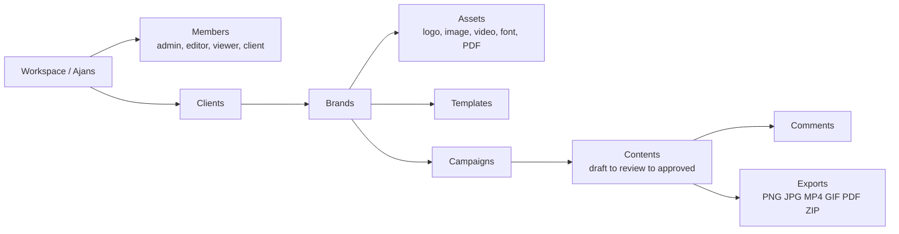

# Content Creator — MVP Planı

## 1. Ürün Özeti

**Content Creator**, ajansların birden fazla müşterisinin markaları için sosyal medya içeriğini **bulk** şekilde üretmesini sağlayan bir web SaaS. Temel değer önerisi: bir brief / prompt / CSV / asset seti → onlarca platform-optimize içerik (görsel + video + copy), onay akışından geçip export edilir.

## 2. Bilgi Mimarisi (Agency Modeli)




## 3. Teknik Stack

- **Frontend:** Next.js 15 (App Router) + TypeScript + Tailwind CSS v4 + shadcn/ui + Framer Motion + `next-intl` (TR UI)
- **State/Data:** TanStack Query + Zustand (local UI)
- **Canvas editor:** Konva / react-konva (layer tabanlı şablon editörü)
- **Medya işleme:** `sharp` (server, raster), `ffmpeg.wasm` (client-side bulk converter fallback: server-side `ffmpeg` Edge Function)
- **Backend:** Supabase (Postgres + Auth + Storage + RLS + Edge Functions)
- **AI:** Adapter katmanı — **mock-first**, sonra gerçek API'lar (Gemini 2.5 "Nano Banana Pro", Seedream, Kling)
- **Upload:** `react-dropzone` + resumable chunk upload (büyük video için)
- **Export:** server-side `sharp` + `ffmpeg` + `pdf-lib`, istek üzerine `archiver` ile ZIP

## 4. Veri Modeli (özet)

Supabase tabloları (RLS workspace rolüne göre):

- `workspaces`, `workspace_members(role)`
- `clients` → workspace'e bağlı
- `brands` → client'a bağlı; `colors jsonb`, `fonts jsonb`, `tone text`, `keywords text[]`, `guideline_pdf_url`
- `brand_assets` → `type (logo|image|video|font|doc)`, `folder`, `tags text[]`, `version`, `parent_id`
- `templates` → `scope (workspace|brand)`, `layers jsonb`, `preview_url`
- `campaigns` → brand'e bağlı
- `content_jobs` → bulk job, `input_type`, `payload jsonb`, `status`, `progress`
- `contents` → `platform`, `aspect_ratio`, `status (draft|review|approved|ready)`, `caption`, `hashtags[]`, `layers jsonb`, `export_urls jsonb`, `ai_provider`, `language`
- `comments` → content'e bağlı
- `asset_usages` → asset ↔ content
- `client_portal_tokens` → scoped erişim

## 5. Sayfa Haritası

- `/` — Marketing landing (buzzabout estetiği, ambient blobs, scroll reveal)
- `/app` — Auth sonrası workspace seçimi
- `/app/[workspace]` — Dashboard (müşteriler, son kampanyalar, jobs queue)
- `/app/[workspace]/clients/[client]/brands/[brand]`:
  - `/assets` — Asset kütüphanesi (bulk upload, klasör/tag, auto-tag, versions, search, usage)
  - `/templates` — Preset galeri + editor (Konva), user templates, AI layout öneri
  - `/campaigns` — Kampanya listesi
  - `/campaigns/[id]` — İçerik board'u (kanban: draft/review/approved/ready + yorumlar)
  - `/create` — **Bulk Creator** sihirbazı (5 adım)
  - `/convert` — **Bulk Converter** (asset'leri oran/format dönüştürme)
  - `/settings` — Renkler, fontlar, logolar, tone, rehber PDF, keywords
- `/portal/[token]` — Client portal (sadece kendi markasını görür, onaylar/yorumlar)

## 6. Core Feature Akışları

### 6.1 Bulk Creator Sihirbazı (5 adım)

1. **Input method** — prompt+N varyant / CSV-Excel yükleme / kampanya brief'i / template×assets / platform multiply
2. **Platform & Aspect** — IG, TikTok, X, LinkedIn, FB, YouTube × (1:1, 4:5, 9:16, 16:9, custom)
3. **Brand binding** — otomatik palette/font/logo enjeksiyonu, dil seçimi (multi-content)
4. **AI provider** — görsel: **Nano Banana Pro (default)**; video: **Seedream / Kling**; copy: full (caption + başlık + hashtag + CTA)
5. **Review & Generate** — job kuyruğu, animasyonlu progress, sonuçlar campaigns board'una düşer

### 6.2 Onay Akışı

`draft → review → approved → ready` — rol tabanlı izinler, client portal sadece `review` ve `approved` görür; yorum bırakabilir, onay verebilir.

### 6.3 Bulk Converter

Asset library'den seçim → hedef platform/oran/format listesi → batch işlem (sharp + ffmpeg) → ZIP.

## 7. AI Adapter Katmanı (mock-first)

```
lib/ai/
  imageGen.ts       // nanoBananaPro (default), seedream
  videoGen.ts       // seedream, kling
  edit.ts           // bgRemove, upscale, inpaint
  copyGen.ts        // caption, title, hashtags, CTA (multi-lang)
  autoTag.ts        // asset otomatik etiketleme
  layoutSuggest.ts  // brief → template layer JSON
```

Her biri tipli kontrat + mock implementation. Gerçek API swap'i tek satırda olur.

## 8. Tasarım Sistemi

- **Tema:** sistem ayarına göre auto (dark/light), `class` stratejisi
- **Palet:** CSS değişkenleri üzerinden token'lı — başlangıç palet önerisi (onay/revize açık):
  - bg: deep indigo (`#0B0B1A` → `#101028`)
  - accent gradient: violet `#7C5CFF` → cyan `#22D3EE` (alternatif: violet → pink)
  - surface glass: `rgba(255,255,255,0.04)` + blur
- **Tipografi:** Inter (body) + Space Grotesk (display)
- **Animasyonlar:** ambient gradient blobs (arka plan), scroll-reveal (Framer Motion `whileInView`), hover micro (glow + lift), page transitions (layout animasyonu), skeleton + shimmer, **jobs queue için animasyonlu progress kartları**
- **UI kiti:** shadcn/ui + custom button/card varyantları (gradient border, glow)

## 9. MVP Kapsam Dışı (sonraki faz)

- Direkt sosyal medyaya publish / scheduling
- Analitik / performans raporları
- Gerçek AI API bağlantıları (mock'lar önce devreye girer)
- Takım sohbeti / realtime editör

## 10. Riskler & Notlar

- **Nano Banana Pro / Seedream / Kling** API'ları doğrulanacak (Nano Banana Pro = Google Gemini 2.5 Flash Image Pro; Seedream = ByteDance; Kling = Kuaishou). Adapter mock-first olduğu için bu risk izole.
- Büyük video upload + export için storage kotası ve Edge Function süre limiti (Supabase'de 150s) dikkate alınmalı — gerekirse arka planda ayrı bir job worker (ileriki faz).
- Konva editor'ü MVP'de **basit tutulacak** (text, image, shape, logo; complex video editing yok).

